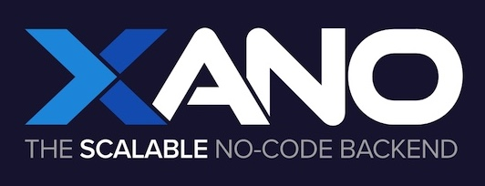

# Xano Development Methodology Repository

Welcome to the Xano Development Methodology repository. This project explores the principles of effective software development methodologies for Xano.

This Methodology is designed for all Xano developers seeking a structured approach to development, especially when collaborating in teams. It establishes a set of foundational principles for coding methodology, including best practices for naming conventions, algorithm design, design patterns, and effective teamwork strategies.

I created this guide after observing that many no-code developers often lack clarity on core development practices. However, this document is meant to be a living, **collective resource**—not a static, definitive rule set. The goal is to foster ongoing collaboration, inviting the community to propose and discuss improvements so the methodology can continue to adapt as development approaches evolve.

While specifically tailored for Xano, the concepts outlined can also be adapted for other platforms and visual coding languages. The methodology draws inspiration from various established coding practices, aiming to provide a stable, effective, and *community-driven* foundation for professional development within Xano.

## How to Contribute
1. Read the [Xano Development Methodology.md](https://github.com/gmaison/xdm/blob/main/Xano%20Development%20Methodology.md).
2. Provide feedback via [Issues](https://github.com/gmaison/xdm/issues).
3. Elaborate on a [Discussion](https://github.com/gmaison/xdm/discussions).
4. Suggest edits using [Pull Requests](https://github.com/gmaison/xdm/pulls).

Thank you for participating!

## Contributors
* Creator and Coordinator: [Guillaume Maison](https://www.linkedin.com/in/gmaison/)
